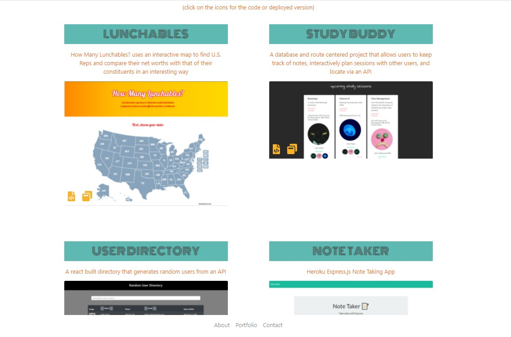

# My React Portfolio

## Description

A developer portfolio using React.

## Features

* About page: A rundown on my coding knowledge and what I'm currently working on. The image is an easter egg that links to my band's spotify page.

* Portfolio page: Six projects appear that load in through a JSON file, making it easy to update my portfolio and add future projects without having to write much code. I added a title, description, links to the repo and deployed version, and pathed the images load. 

* Contact page: A clean, simple page without any distractions. Here are links to my contact info and an option to download my resume, which has more personal contact information.

* Media screen resizing: My profile picture, footer, projects, and fonts all resize with the screen, allowing an easy mobile experience.

## Technologies

```
React

Bootstrap

Font Awesome

ES Lint
```

## Links

[Repo](https://github.com/najuasaad/react-portfolio)

[Deployed](https://najuasaad.github.io/)

## Screenshots


